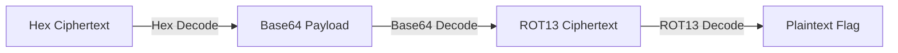

# Layered Transmission Writeup

## 🏷️ Challenge Overview
* **Difficulty:** Easy
* **Category:** Cryptography / Forensics
* **Objective:** Decode an intercepted ciphertext string to retrieve the hidden flag in the format `SecLeaf{...}`.

**Provided Payload:**
```text
526e4a7757584a756333737759544e66655452734d325666616a526d595764664d3245776148523166513d3d0a
```

---

## 🛠️ Solution Strategy
The analyst notes indicated that the message passed through multiple transformation layers. By examining the structural characteristics of the payload, we can deduce and reverse the encoding schemes sequentially (hexadecimal characters, Base64 padding, and monoalphabetic substitution).



---

## 🔓 Step-by-Step Decoding

### Step 1: Hexadecimal Decoding
The raw intercepted payload consists entirely of valid hexadecimal characters (`0-9`, `a-f`). Decoding this hex stream into ASCII text reveals a recognizable Base64-encoded string ending with standard padding signs (`==`).

* **Ciphertext:** `526e4a7757584a756333737759544e66655452734d325666616a526d595764664d3245776148523166513d3d0a`
* **Decoded Output (Base64):** `RnJwWXJuc3swYTNfeTRsM2VfajRmYWdfM2EwaHR1fQ==`

### Step 2: Base64 Decoding
Decoding the intermediate string from Base64 uncovers a ciphertext structure that mirrors the standard flag layout (`xxxYxxx{...}`), though the specific alphabetic characters are obfuscated.

* **Payload:** `RnJwWXJuc3swYTNfeTRsM2VfajRmYWdfM2EwaHR1fQ==`
* **Decoded Output:** `FrpYrns{0a3_y4l3e_j4fag_3a0htu}`

### Step 3: ROT13 Substitution Cipher
The output pattern strongly hints at a classic monoalphabetic substitution cipher. Because `F` maps to `S`, `r` to `e`, and `p` to `c`, we can confirm a `ROT13` (Caesar Cipher with a key shift of 13) transformation.

Applying a 13-character shift to the alphabetic characters while preserving numbers and underscores reveals the plain text flag.

| Cipher Character | Shift (+13) | Plain Character |
|---|---|---|
| `F` | $\rightarrow$ | `S` |
| `r` | $\rightarrow$ | `e` |
| `p` | $\rightarrow$ | `c` |
| `Y` | $\rightarrow$ | `L` |
| `0` | (No shift) | `0` |
| `a` | $\rightarrow$ | `n` |
| `y` | $\rightarrow$ | `l` |

Executing this transformation across the entire ciphertext blocks out the complete key phrase.

---

## 🏁 Final Flag
```text
SecLeaf{placeholder_flag}
```
