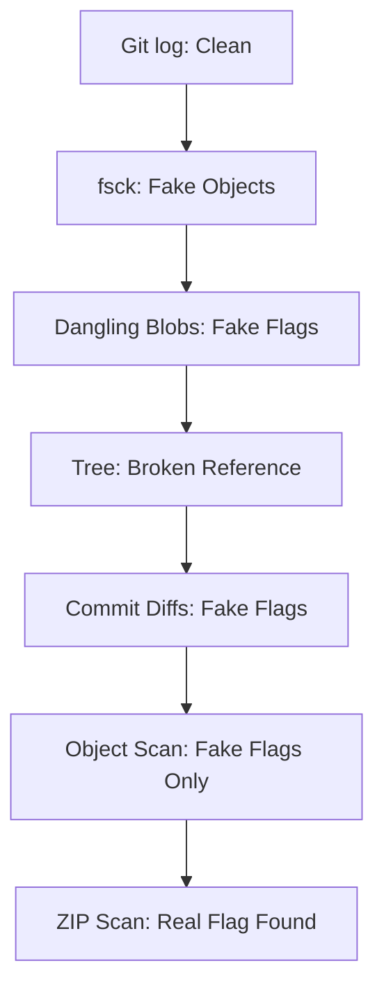

# Force Push Won’t Save You

## 🏷️ Challenge Summary
We are given a Git repository where a developer repeatedly force-pushed changes before the project was archived. The goal is to recover sensitive data that may still exist in the Git history, including unreachable objects.

---

## 📦 Initial Extraction
```bash
unzip challenge.zip
cd force-push-wont-save-you
ls -la
```

**Observations:**
* A Git repository (`.git/`)
* A minimal working file (`app.js`)
* No obvious sensitive files in the working directory

---

## 🔍 Git History Inspection
```bash
git log --all --oneline --graph
```

We find a normal commit history:
```text
final
fix
final cleanup
urgent cleanup
remove sensitive file before push
initial commit
```
At first glance, nothing appears suspicious.

---

## 🧩 Attempt 1: Reflog and Hidden Commits
```bash
git reflog
```
No additional useful history is found here.

---

## 🧪 Attempt 2: Searching for Unreachable Objects
```bash
git fsck --full --no-reflogs
```

We discover:
* A dangling commit
* A dangling blob

These are extracted via:
```bash
git fsck --lost-found
```

**Results:**
* Dangling commit: `SecLeaf{decoy_flag_1}`
* Dangling blob: `SecLeaf{decoy_flag_2}`

> [!WARNING]
> These are confirmed decoys.

---

## 🧱 Attempt 3: Inspecting Git Objects
We scan all objects:
```bash
git rev-list --objects --all
```

We also brute-force object inspection:
```bash
git cat-file -p <object>
```

**Result:** No real flag found; only a fake flag: `SecLeaf{decoy_flag_3}`

---

## 🧨 Attempt 4: Tree Object Investigation
A dangling tree is found: `e784766c...`

Inspecting it:
```bash
git cat-file -p e784766c...
```
It references:
* `app.js`
* `secrets.txt` $\rightarrow$ `24dab13a...`

However:
```bash
git cat-file -p 24dab13a...
```
gives: `fatal: Not a valid object name`

**Insight:** This object reference is a fake/broken pointer, meaning the tree is intentionally misleading.

---

## 🧪 Attempt 5: Commit Diff Analysis
We inspect commits involving file cleanup:
```bash
git show b7d5c13
git show 0fbc9b5
```

We find: `SecLeaf{decoy_flag_4}` (another decoy).

---

## 🧱 Attempt 6: Exhaustive Git Search
```bash
git grep SecLeaf
git rev-list --objects --all | grep SecLeaf
```
Only fake flags appear.

**Conclusion:** The Git history is fully poisoned with decoys.

---

## 🧨 Critical Observation
Even though Git recovery tools are exhausted:
1. No real flag exists in Git objects.
2. All dangling objects are fake.
3. Tree references are invalid.

This indicates that the flag is not in the Git history at all.

---

## 📦 Final Pivot: ZIP Layer Investigation
We move outside of Git and inspect the ZIP archive itself:
```bash
strings challenge.zip | grep SecLeaf
```

**Result:**
```text
SecLeaf{placeholder_flag}
SecLeaf{decoy_flag_2}
```

---

## 🏁 Final Flag
```text
SecLeaf{placeholder_flag}
```

---

## 🧠 Key Learnings
1. **Git Forensics Traps:** Not all Git-recoverable data is real. CTFs often inject dangling blobs, dangling commits, and broken tree references as fake flags.
2. **`fsck` is Not Enough:** Even `git fsck --full` can miss the real answer if objects are intentionally excluded or if data lies outside the Git object database.
3. **Always Validate Scope:** If Git history is fully exhausted and the object database yields only decoys, step back and inspect the filesystem, archive layers, metadata, and non-Git sources.
4. **Pattern Recognition:** If multiple fake flags appear, assume intentional misdirection and stop over-investing in Git internals.

---

## 🧾 Summary Flow

