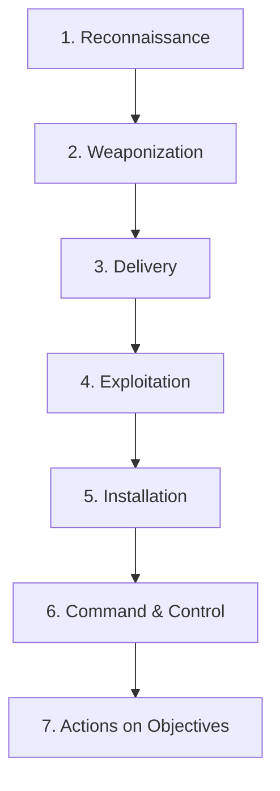

# Cyber Kill Chain

**Platform:** TryHackMe  
**Room:** Cyber Kill Chain  
**Category:** Threat Intelligence / Cyber Defense Frameworks  
**Difficulty:** Easy  

---

## Overview

The **Cyber Kill Chain®** is a cybersecurity framework developed by Lockheed Martin in 2011. Adapted from a military concept, it outlines the phases of a cyberattack from initial reconnaissance to data exfiltration or system destruction. 

For defenders, the primary value of the Cyber Kill Chain is that **an adversary must successfully complete every single phase** in order to achieve their objectives. If a security team can detect, disrupt, or block the attacker at any stage, they break the "chain" and thwart the intrusion.

---

## The 7 Phases of the Cyber Kill Chain

1. **Reconnaissance:** Harvesting email addresses, identifying public-facing systems, and discovering vulnerabilities (passive and active information gathering).
2. **Weaponization:** Coupling exploits with payloads into deliverable payloads (e.g., embedding malicious macros in Office documents).
3. **Delivery:** Transmitting the weaponized payload to the victim (e.g., via spearphishing emails, watering hole websites, or USB drops).
4. **Exploitation:** Executing the malicious code on the target system by exploiting software or human vulnerabilities (e.g., a zero-day exploit).
5. **Installation:** Establishing a backdoor or staging files on the victim's host to maintain persistence (e.g., deploying a web shell or registry run keys).
6. **Command & Control (C2):** Establishing a remote management channel for administrative access to the host (e.g., DNS Tunneling, HTTPS beacons).
7. **Actions on Objectives:** Reaching the final mission goal, such as credential theft, lateral movement, data exfiltration, or system encryption.

---

## Room Questions & Answers

### Task 2 — Reconnaissance
* **Question:** What is the name of the Intel Gathering Tool that is a web-based interface to the common tools and resources for open-source intelligence?  
  * **Answer:** `OSINT Framework`
* **Question:** What is the definition for the email gathering process during the stage of reconnaissance?  
  * **Answer:** `email harvesting`

### Task 3 — Weaponisation
* **Question:** What is the term for automated scripts embedded in Microsoft Office documents that can be used to perform tasks or exploited by attackers for malicious purposes?  
  * **Answer:** `Macro`

### Task 4 — Delivery
* **Question:** What do you call an attack targeting a specific group by infecting their frequently visited website?  
  * **Answer:** `Watering hole attack`

### Task 5 — Exploitation
* **Question:** What is the term for a cyber attack that exploits a software vulnerability that is unknown by software vendors?  
  * **Answer:** `Zero-day`

### Task 6 — Installation
* **Question:** What technique is used to modify file time attributes to hide new or changes to existing files?  
  * **Answer:** `Timestomping`
* **Question:** What malicious script can be planted by an attacker on the web server to maintain access to the compromised system and enables the web server to be accessed remotely?  
  * **Answer:** `Web shell`

### Task 7 — Command & Control
* **Question:** What is the C2 communication where the victim makes regular DNS requests to a DNS server and domain which belong to an attacker?  
  * **Answer:** `DNS Tunneling`

### Task 9 — Practice Analysis (Target Breach Scenario Mapping)
* **Scenario Objective:** Drag and drop the components to their correct positions in the Cyber Kill Chain based on the 2013 Target data breach.
* **Correct Mapping:**
  * **Delivery:** Spearphishing attachment
  * **Weaponization:** Powershell
  * **Exploitation:** Exploit public-facing application
  * **Installation:** Dynamic linker hijacking
  * **Command & Control (C2):** Fallback channels
  * **Actions on Objectives:** Data from local system
* **Question:** What is the flag?  
  * **Answer:** `THM{7HR347_1N73L_12_4w35om3}`

---

## Key Learnings

- **Adversary Dependency:** Attackers depend on a successful chain. Defenders have the home-ground advantage—they only need to win one battle (break one link) to disrupt the threat, whereas attackers must win all seven.
- **Defensive Gap Identification:** The Cyber Kill Chain helps organizations map their current detection visibility and identify where their defenses are weakest (e.g., if we only detect C2 activity, we are failing in 5 previous phases).
- **Linear Limitation:** Traditional Cyber Kill Chain assumes a strictly linear path and focuses heavily on perimeter intrusion. Modern networks require defensive models that account for internal lateral movement and cloud infrastructures (such as the Unified Kill Chain).
