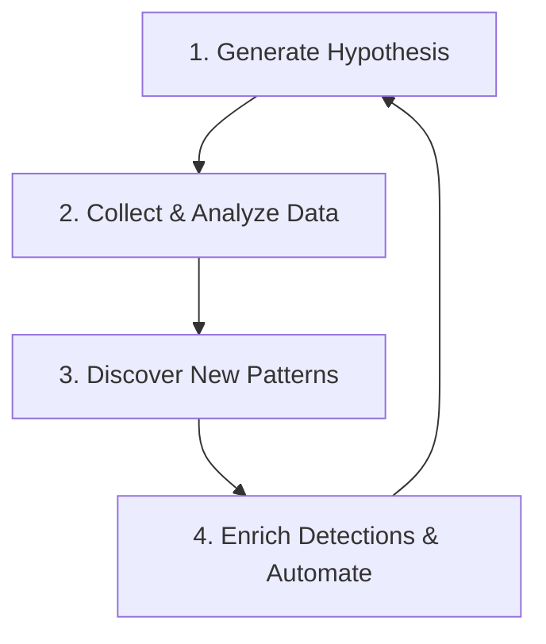

# Threat Hunting: Introduction

**Platform:** TryHackMe  
**Room:** Threat Hunting: Introduction  
**Category:** Threat Hunting / Incident Response  
**Difficulty:** Easy  

---

## Overview

Modern security operations cannot rely solely on automated detection systems. Threat hunting is the proactive, analyst-led process of searching networks and endpoints to detect malicious activity that has evaded existing security controls. This room explores the foundational mindset, structured processes, and analytical frameworks required to successfully hunt for threats within an enterprise environment.

---

## The Threat Hunter's Mindset: Assume Compromise

Traditional security relies on reactive monitoring (e.g., waiting for an alert from a SIEM or antivirus). Threat hunting begins with the **Assumption of Compromise**:

- Automated controls are imperfect and can be bypassed by sophisticated adversaries.
- Attackers may already be present in the network (dwell time) without triggering existing alerts.
- Instead of asking *"Are we secure?"*, a threat hunter asks: *"How has the adversary bypassed our controls, and where are they hiding?"*

---

## The Threat Hunting Loop

Threat hunting is not a random search; it is an iterative, structured cycle:

1. **Hypothesis Generation:** Create a testable statement about potential adversary activity based on threat intelligence, recent campaigns, or architectural weaknesses.
2. **Data Collection & Analysis:** Identify and gather the relevant log sources (e.g., Sysmon, event logs, firewall logs) and query them to prove or disprove the hypothesis.
3. **Pattern Discovery:** Identify indicators of compromise (IOCs) or tactics, techniques, and procedures (TTPs) indicating active or past compromise.
4. **Detection Enrichment:** Turn successful hunts into permanent detection rules (SIEM alerts, YARA rules, Sigma rules) to automate future identification, then start the loop again.

---

## Core Frameworks

Threat hunting leverages standardized frameworks to structure hunts and understand adversary behavior.

### 1. MITRE ATT&CK Framework
A globally-accessible knowledge base of adversary tactics and techniques based on real-world observations. Threat hunters use it to:
- Map current visibility gaps.
- Design hunts targeting specific techniques (e.g., LSASS memory dumping, registry run keys).
- Categorize discovered activities.

### 2. The Cyber Kill Chain
Developed by Lockheed Martin, this model outlines the phases of a cyberattack:
1. **Reconnaissance**
2. **Weaponization**
3. **Delivery**
4. **Exploitation**
5. **Installation**
6. **Command & Control (C2)**
7. **Actions on Objectives**

Understanding these phases helps hunters trace the progression of an attack and deploy countermeasures at multiple stages.

### 3. The Pyramid of Pain
This model represents how difficult it is for an adversary to modify their attack details when a hunter detects them:

| Level | Indicator Type | Evasion Difficulty for Attacker | Actionable Hunting Value |
|---|---|---|---|
| **Tough** | TTPs (Adversary Behavior) | High (Requires changing tools/playbooks) | Excellent (Long-term value) |
| **Challenging** | Tools | Medium (Must rebuild or modify tool) | Very Good |
| **Simple** | Network/Host Artifacts | Medium-Low (Registry keys, user agents) | Good |
| **Easy** | Domain Names | Low (Spin up new DNS domains) | Low |
| **Easy** | IP Addresses | Low (Change proxy, VPN, or VPS redirector) | Low |
| **Trivial** | Hash Values | Trivial (Change a single byte in the file) | Very Low |

*Note: Threat hunters prioritize hunting for **TTPs** and **Tools** rather than fragile artifacts like file hashes and IPs.*

---

## Threat Hunting Methodologies

Hunts are generally categorized into three types:

1. **Intel-Driven Hunts:** Triggered by new threat intelligence reports, vulnerability disclosures, or shared IOCs/TTPs from external groups (ISACs, CISA alerts).
2. **Hypothesis-Driven Hunts:** Initiated by the analyst's domain knowledge, aligning with MITRE ATT&CK techniques or internal architectural risk assessments.
3. **Custom / Analytics-Driven Hunts:** Leveraging machine learning, statistical anomalies, or outlier analysis of log data (e.g., spotting command-line arguments that deviate from corporate baselines).

---

## Conclusion & Key Learnings

- Threat hunting is a **proactive** discipline, whereas SOC monitoring is **reactive**.
- Effective hunting depends heavily on the quality and completeness of endpoint and network logs (visibility).
- Anchoring hunts in behaviors (TTPs) rather than static indicators (hashes, IPs) creates resilient, long-lasting detection capabilities that force attackers to redesign their operations.
